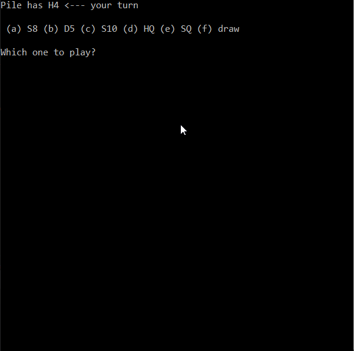

# *Crazy Eights Game*

Crazy Eights Game is a card game in which players try to get rid of their hand by playing a matching rank or suit on the previous card played, having to draw an additional card if unable to do so; a player who plays an eight can dictate the suit to be played next.

Implemented by **Anderson Tan**

**Notes:** 

The implmentation of this game is not ran on a graphical user interface. 

A standard 52-card pack is made up of 13 ranks in each of the four French suits: Clubs (♣), Diamonds (♦), Hearts (♥) and Spades (♠).

In this case, the suit followed by a rank represents the card. For instance, HA represents the Ace of Hearts and D2 represents the Two of Diamonds, etc...

**The starting case of the game:**

**The winning case:**

**Simulation:**

A simple simulation of the game ran on Microsoft Visual Studio IDE. 

